# Bienvenue sur Blue Frontline

Ceci est la documentation du projet **Blue Frontline**.

Dans un monde moderne bouleversé par la chute d’une météorite, l’environnement s’est transformé en un archipel d’îles quantiques. Deux grandes puissances s’affrontent pour contrôler cette zone et y mener des recherches. Votre objectif: détruire la base adverse.

- Plateformes: Windows et Linux
- Mode de jeu: 1 contre 1 (Joueur vs IA ou IA vs IA)

## Sections

- [L'histoire](#lhistoire)
- [L'installation](#linstallation)
- [Le menu](#le-menu)
- [Le jeu](#le-jeu)
- [Les contrôles](#les-contrôles)
- [HUD](#hud)
- [Les unitées](#les-unitées)
- [Les marées et les iles quantiques](#les-marées-et-les-iles-quantiques)

## L'histoire

La chute d’une météorite a altérée le monde et créée des **îles quantiques** changeantes. Deux puissances rivales se disputent la zone de l’impact pour y conduire des recherches. Dans ce théâtre mouvant, chaque bataille a un but clair: **détruire la base ennemie**.

## L'installation

Il existe deux façons d'installer et de lancer **Blue Frontline** :  

## 1. Téléchargement de l'exécutable

1. Rendez-vous sur le dépôt GitHub officiel : [Blue Frontline GitHub](https://github.com/keylian15/blue_frontline).  
2. Cliquez sur l’onglet **Releases**.  
3. Téléchargez l'exécutable correspondant à votre système.  

> ⚠️ Note : Certains antivirus peuvent détecter l'exécutable comme un faux positif.

## 2. Lancement depuis le code source

1. Toujours depuis l'onglet **Releases**, téléchargez le code source si vous ne souhaitez pas utiliser l’exécutable.  
2. Décompressez le fichier téléchargé.  
3. Assurez-vous d’avoir **Python** installé sur votre machine.  
4. Ouvrez un terminal dans le dossier du projet et lancez :  

```bash
python blue_frontline/main.py
```

## Le menu

- **Jouer**: lancer une partie 1v1 (Joueur vs IA, ou IA vs IA pour observer).
- **Succès**: consulter les succès débloqués.
- **Options**: réglages, notamment le **remapping des touches**.
- **Quitter**: fermer le jeu.

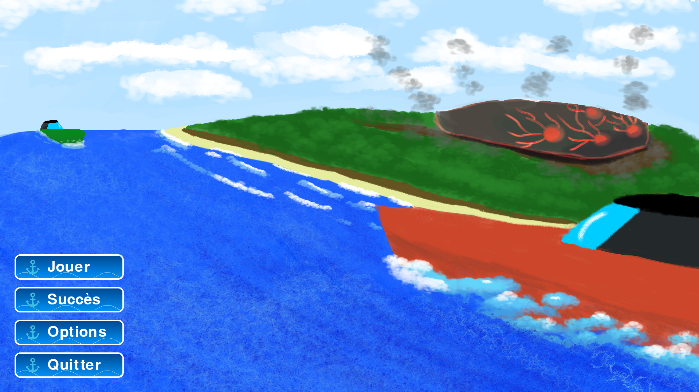

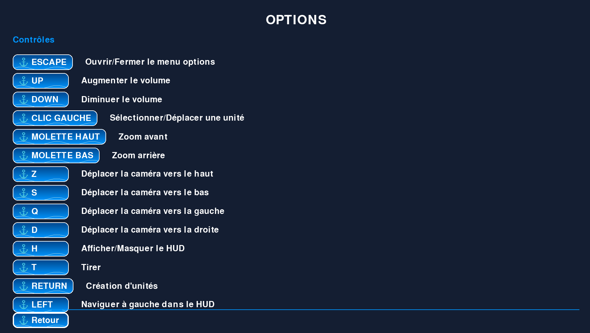
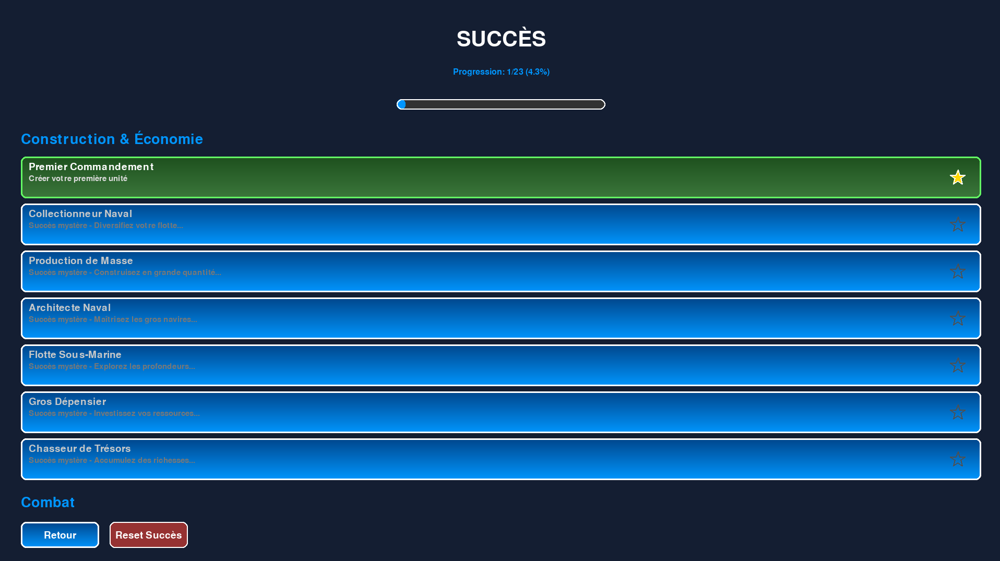

## Le jeu

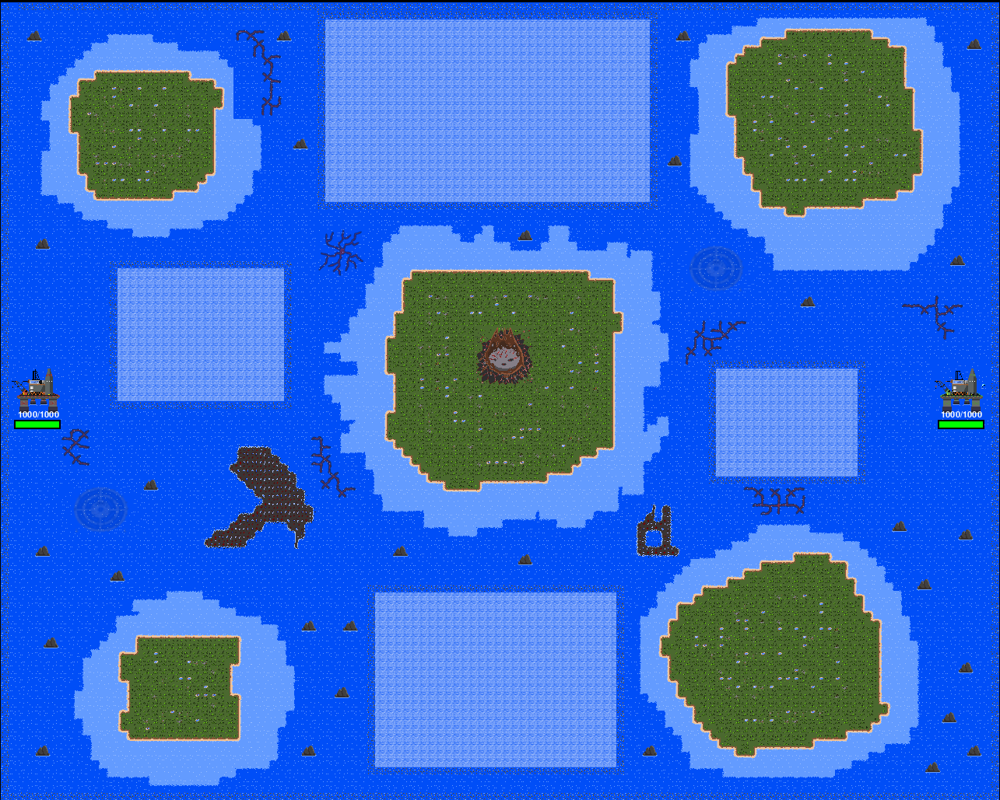

- Objectif: détruire la **base adverse**.  
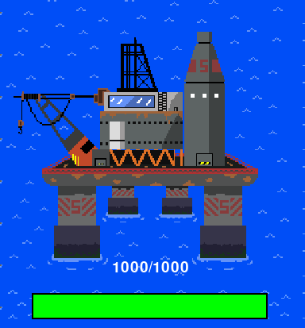


- La carte évolue au rythme des **marées** (toutes les 3 minutes: haute/basse), modifiant le terrain.
- Des zones sont masquées par le **brouillard**: envoyez des **éclaireurs** pour les révéler et découvrir de nouvelles îles quantiques.
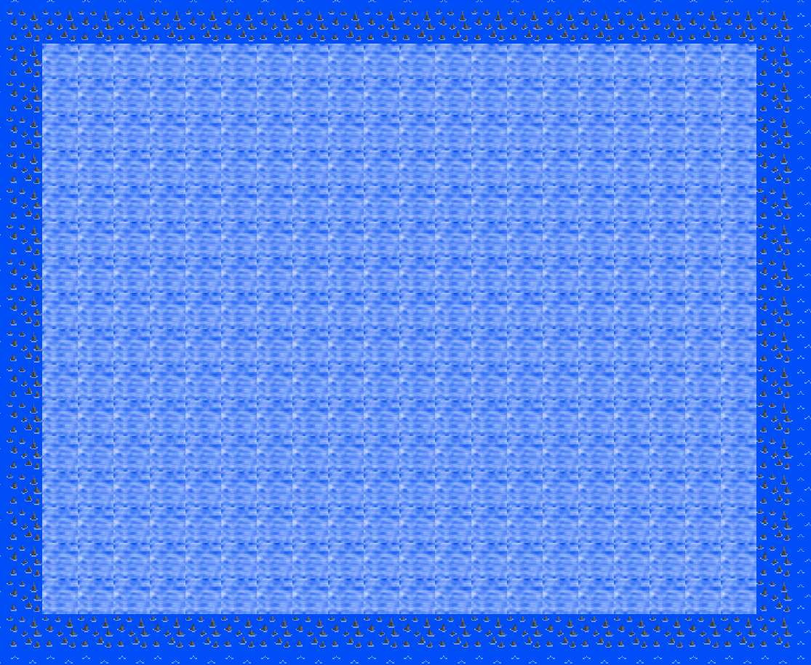

**Ressources**  
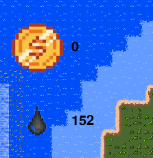  
- **Pétrole**: achat d’unitées. Généré passivement, accélérable grace aux **pompes**.
- **Argent**: obtenu en détruisant des unitées ennemies. Sert aux **améliorations**.


## Les contrôles

- **ZQSD**: Déplacer la caméra sur la carte.
- **Flèches directionnelles Gauche Droite**: Choisir l’unitée à poser.
- **Entrée**: Poser l’unitée sélectionnée.
- **Clic gauche**: Sélectionner une unitée, puis cliquer sur une destination pour la déplacer.
- **Clic droit**: ultiliser la capacité spéciale de l'unitée.
- **T**: Tirer lorsqu’une unitée ennemie est à portée.
- **V**: Changer la vitesse du jeu.
- **H**: Afficher/masquer l’interface.
- **J**: Changer d’équipe.

Remapping: possible dans le **menu Options**.

## HUD

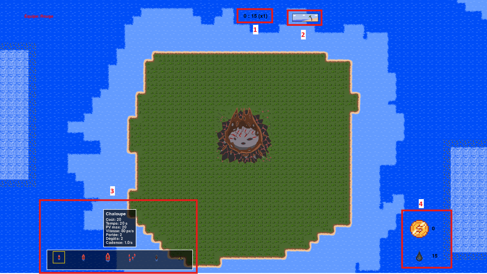

1 - **Timer**: Temps passé depuis le debut de la partie.  
2 - **Icône de marée**: Etat actuel (haute/basse).  
3 - **menu d'unitée**: Permet de deployer des unitées.    
4 - **Compteurs de ressources**: **Pétrole** et **argent** disponibles.  

## Les unitées
- Sélectionner une unitée dans le menu des unitée a l'aide des fleches directionnelles puis appuyer sur entré pour la faire apparaitre près de votre base 
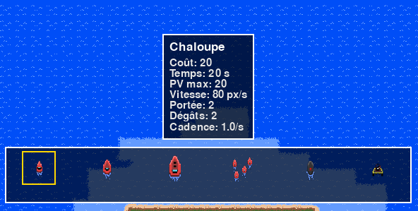
- Cliquez sur une unitée pour la **sélectionner**, puis sur une **destination** pour la déplacer.
- Appuyez sur **T** pour tirer lorsqu’une cible est à portée.
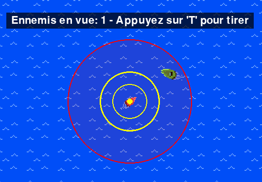

il ya plusieurs unitées disponibles:

### Les chaloupes
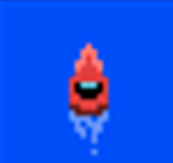  
**Description**  
Les chaloupes sont des unitées de base : elles sont rapides et peu chères, mais fragiles.

**Stats**  
**Coût**:20  
**PV max**:20  
**Vitesse**:80px/s  
**Portée**:2  
**Dégâts**:2  
**Cadence**:1/s  
__________________________________  
### Les bateaux
  
**Description**  
Les bateaux sont des unitées de taille moyenne : ils sont plus résistants que les chaloupes, tirent davantage, mais sont légèrement plus lents et plus chers.

**Stats**  
**Coût**:60  
**PV max**:30  
**Vitesse**:70px/s  
**Portée**:6  
**Dégâts**:6  
**Cadence**:1/s 
__________________________________  
### Les paquebots
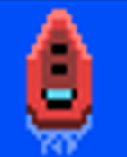  
**Description**  
La meilleure unitée disponible : elle est très lente, mais compense sa lenteur grâce à sa robustesse et à sa puissance de tir accrue.  

**Stats**  
**Coût**:120  
**PV max**:50  
**Vitesse**:60px/s  
**Portée**:8  
**Dégâts**:10  
**Cadence**:0.8/s
__________________________________  
### Les éclaireurs
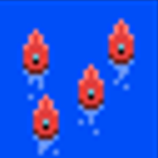  
**Description**  
Les éclaireurs ne sont pas des unitées de combat : ils servent principalement à découvrir les zones de brouillard sur la carte et permettent ainsi de traverser les zones d’îles quantiques.

**Stats**  
**Coût**:40    
**PV max**:15    
**Vitesse**:100px/s    
**Portée**:-  
**Dégâts**:-  
**Cadence**:-  
__________________________________  
### Les sous marin
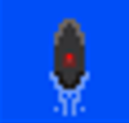  
**Description**    
Les sous-marins sont des unitées classiques, mais ont la particularitée de pouvoir déposer des mines.  

**Stats**  
**Coût**:180    
**PV max**:35   
**Vitesse**:65px/s    
**Portée**:5  
**Dégâts**:18   
**cadence**:0.5/s    
__________________________________  
### Pompes
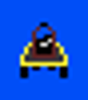  
**Description**  
Les pompes permettent d’améliorer votre rendement en pétrole.

## Améliorations  
Lorsque vous détruisez des troupes adverse vous recuperer des pieces qui peuvent être utilisées pour des améliorations:  
### Destruction :  
• 1 : 1 pièce – Coût : Gratuit (défaut)  
• 2 : 2 pièces – Coût : 100 pièces  
• 3 : 3 pièces – Coût : 200 pièces  
• 4 : 4 pièces – Coût : 500 pièces  
### Dégâts de la base :  
• 1 : 10% du blindage de la Chaloupe – Coût : Gratuit (défaut)  
• 2 : 20% du blindage de la Chaloupe – Coût : 200 pièces  
• 3 : 30% du blindage de la Chaloupe – Coût : 400 pièces  
• 4 : 40% du blindage de la Chaloupe – Coût : 600 pièces  
### Vitesse de la base :  
• 1 : 1 tir / 4 secondes – Coût : Gratuit (défaut)  
• 2 : 2 tirs / 4 secondes – Coût : 200 pièces  
• 3 : 3 tirs / 4 secondes – Coût : 400 pièces  
• 4 : 4 tirs / 4 secondes – Coût : 600 pièces  

## Les marées et les iles quantiques  

- La **marée** alterne toutes les 3 minutes entre **haute** et **basse**, changeant la topographie.
- Les **îles quantiques** se **submergent** puis **réapparaissent** différemment après chaque cycle.

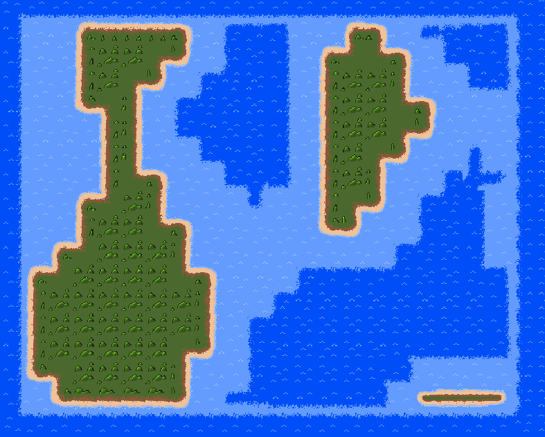

